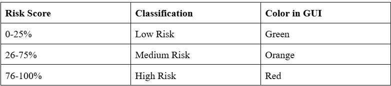
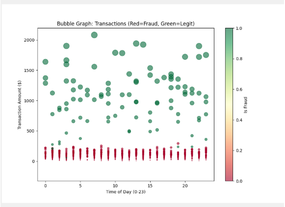
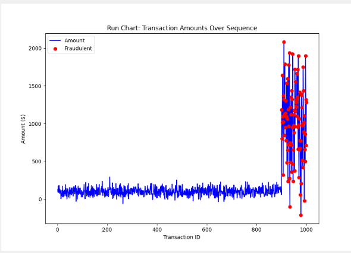
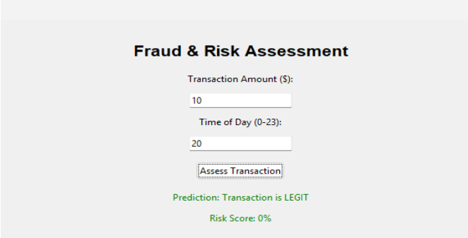
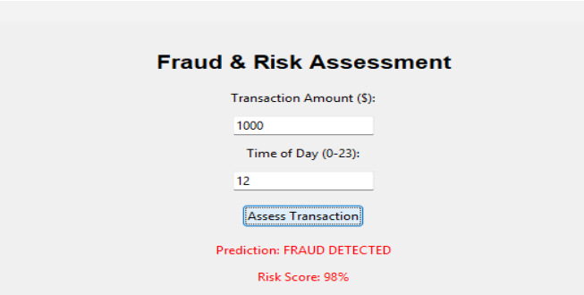

# Fraud-detection-and-risk-assessment
This is our Applied Data Science Case Study Project

## 🚨 Fraud Detection & Risk Assessment - Applied Data Science (ADS) Case Study

This repository contains the **Applied Data Science (ADS)** case study, developed as part of our academic curriculum. The project focuses on **fraud detection** and **risk assessment** using data science techniques and models to analyze and predict fraudulent activities in financial datasets.

## 🧠 Problem Statement

The goal of this project is to design and implement a fraud detection and risk assessment model that can efficiently identify potentially fraudulent transactions or activities within a given dataset. The system applies machine learning algorithms and statistical analysis to detect suspicious patterns and assess risks associated with different financial entities.

## 🔬 Approach & Methodology

- **Data Collection & Preprocessing:**  
  Data was gathered from [this dataset](https://www.kaggle.com/datasets/dhanushnarayananr/credit-card-fraud) and preprocessed using techniques like data cleaning, handling missing values, normalization, and feature engineering.

- **Feature Selection & Engineering:**  
  Focus was placed on selecting features that contribute significantly to predicting fraudulent behavior and assessing risk. Various statistical and data mining techniques were used to identify important features.

- **Modeling & Evaluation:**  
  Several machine learning models were trained to detect fraud, including:
  - Logistic Regression
  - Decision Trees
  - Random Forest
  - Support Vector Machines (SVM)
    

## ⚙️ Technologies Used

- **Programming Language:** Python
- **Libraries & Frameworks:**
  - Pandas, Numpy (Data Manipulation)
  - Scikit-Learn (Modeling & Evaluation)
  - Matplotlib, Seaborn (Visualization)
  - XGBoost (for boosted trees)
  - Tkinter (for GUI deployment)

Models were evaluated using accuracy, precision, recall, F1-score, and ROC-AUC.

## Risk-Score Classification

**Table 1. Rise Score Table**



## 📊 Screenshots (Charts)


**Fig. 1. Bubble Chart Distribution showcasing Fraud vs Non-Fraud cases**

(Green -> Legitimate transactions, Red -> Fraudulent transactions)




**Fig. 2. Run Chart Distribution (ID vs Transaction Amount)**

This run chart showcases the Transaction Amount over Transaction ID

## 📷 Screenshots (Results)




**Fig. 3. Legitimate (Real) Transactions**




**Fig. 4. Fraudulent (Fake) Transactions**

# 🛠️ Setup Instructions
1. Clone the repository:
   ```bash
   git clone https://github.com/Sai25Hajime/Fraud-detection-and-risk-assessment.git
2. Install dependencies:
   ```bash
   pip install -r requirements.txt
3. Run the Flask app
   ```bash
   python Fraud_Detection.py

